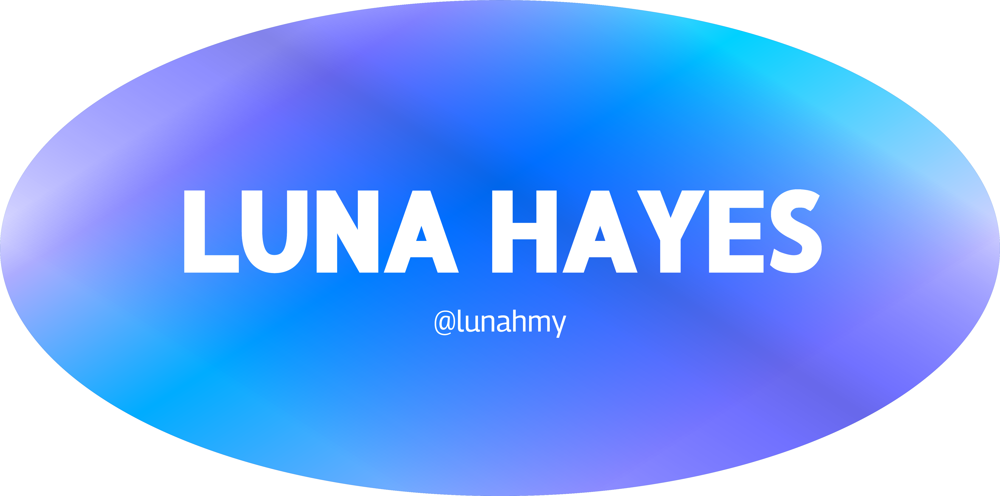
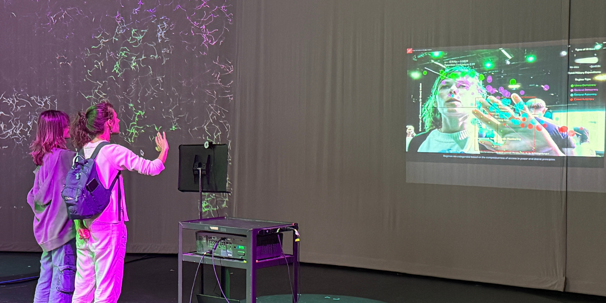

 

 
 
<em>Media designer exploring the intersection of storytelling, interactive art, and creative code.</em>

 
 

---
 
## Featured Repos
 
<table>
<tr>
<td width="50%" align="center">
<strong>Who's Coming to the Zoo?</strong>
 

interactive infographic · journalism · graphic design
 
</td>
<td width="50%" align="center">
<strong>p5.js Sketches + Gallery</strong>
 

generative + computational art · interactive canvas · creative code
 
</td>
</tr>
<tr>
<td width="50%" align="center">
<strong>SIGNAL</strong>
 

digital magazine · editorial design · interactive flipbook
 
</td>
<td width="50%" align="center">
<strong>ONLINE</strong>
 

Twine Harlowe 3.8.8 · web-based game
 
</td>
</tr>
<tr>
<td colspan="2" align="center">
<strong>Un(sur)veiling</strong>

interactive · data visualization · p5.js 
 
</td>
</tr>
</table>

---

## Tools
 

## I also do
 
 

---
 
✦ UNC Ahapel Hill '26 · Media & Journalism · Communication Studies · Japanese Minor ✦

lunahayes.com

