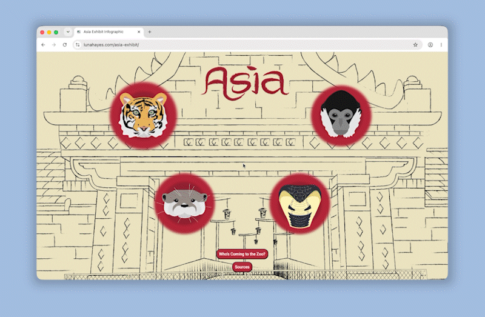
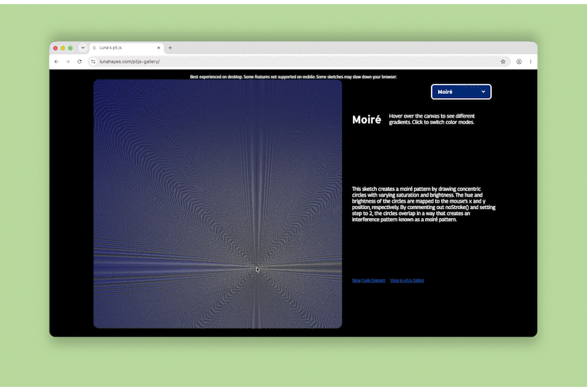
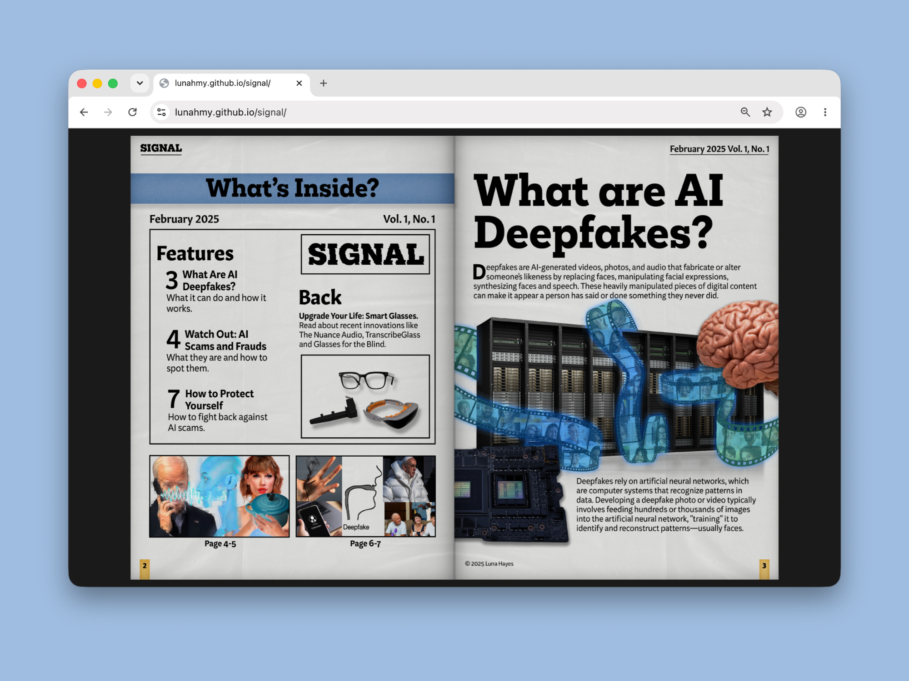
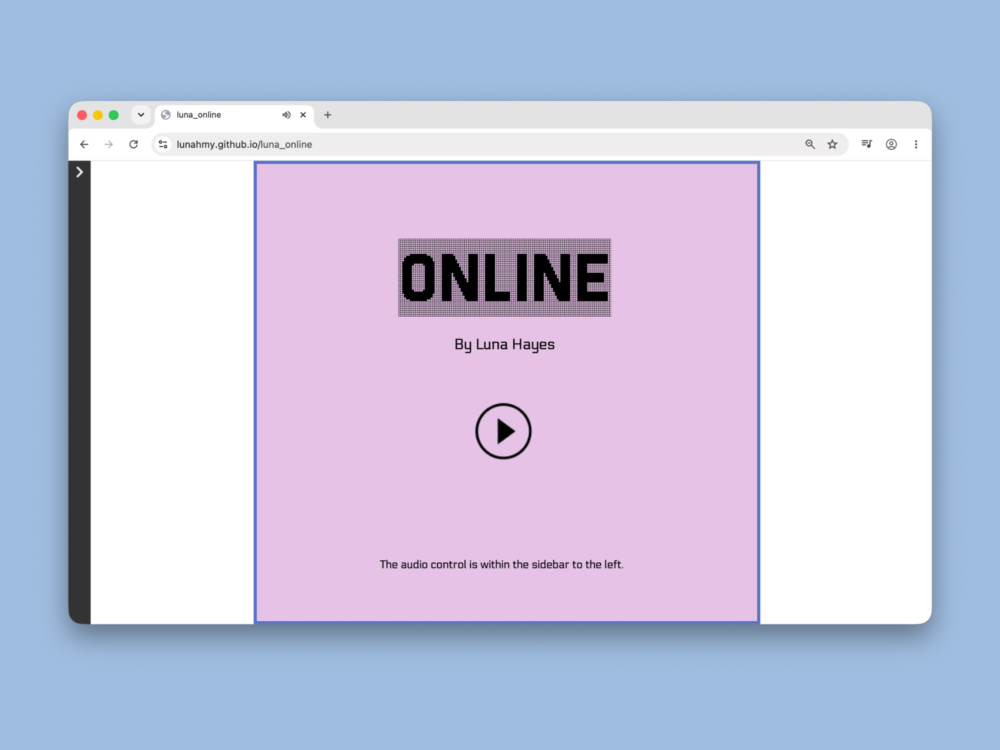
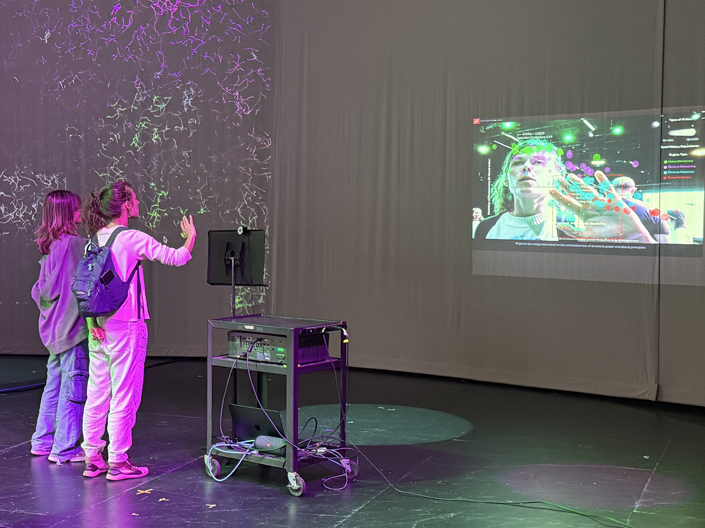

 

## Hi, I'm Luna Hayes

*Media designer exploring the edges of journalism, interactive art, and creative code.*

 

---
 
## Featured Repos
 
<table>
<tr>
<td width="50%" align="center">
**Who's Coming to the Zoo?**
 

NC Zoo Asia exhibit infographic · data visualization · print + digital
 
</td>
<td width="50%" align="center">
**p5.js Sketches + Gallery**
 

generative + computational art · interactive canvas · creative code
 
</td>
</tr>
<tr>
<td width="50%" align="center">
**SIGNAL**
 

digital magazine · editorial design · interactive flipbook
 
</td>
<td width="50%" align="center">
**ONLINE**
 

Twine Harlowe 3.8.8 · web-based game
 
</td>
</tr>
<tr>
<td colspan="2" align="center">
**Un(sur)veiling**

interactive · data visualization · p5.js 
 
</td>
</tr>
</table>

---

## Tech Tools
 

## I also do
 

 
---
 
✦ UNC Ahapel Hill '26 · Media & Journalism · Communication Studies · Japanese Minor ✦
 

